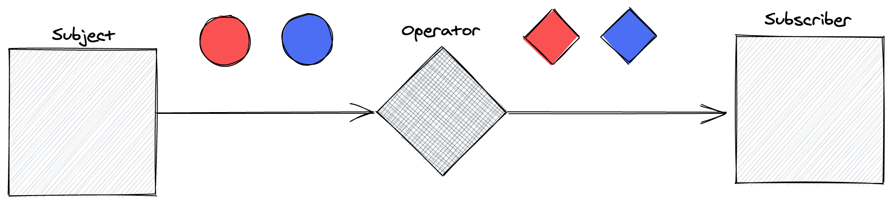

rxjs-kata
=========

Simple exercises to build up some confidence with RxJS.

## What is Rx (Reactive eXtensions)?

Rx is a toolkit originally written for .NET, ported to other languages (like JavaScript) that allows applications
to manipulate unbound streams of data, also abstracting the source of the data.

It is common to confuse Rx observables and arrays (or other streams of data in other languages). In JavaScript, but, they have a few differences:

* Arrays are processed eagerly, so any operation is done at the moment of the definition. However, Observables are lazy, they are not evaluated (or run) until someone `subscribes` to them.

* Arrays are bound to a size of data, usually limited by the amount of memory on the host machine. However, Observables are unbound, and can generate and process unlimited amounts of data.

* [Rx](https://rxjs-dev.firebaseapp.com/api?query=error) has a custom error handling mechanism.

* [Rx](https://rxjs-dev.firebaseapp.com/api) has a huge API with a lot of useful operators that can manipulate streams of data.

Rx can be summarised as in the following picture:



* [A Subject](https://rxjs-dev.firebaseapp.com/api?query=subject) emits information to their subscribers.
* [Operators](https://rxjs-dev.firebaseapp.com/api?query=operators) consume information from the previous subject (or operator), manipulates the data, and decide to emit information or not to the following subscribers in the chain.
* [A Subscriber](https://rxjs-dev.firebaseapp.com/api?query=subscribe) receives information from the Rx chain (usually called [Observable](https://rxjs-dev.firebaseapp.com/guide/observable)).
* [An Observable](https://rxjs.dev/guide/observable) is the entity where you can subscribe (_observe_). An observable is a chain of one subject and many optional operators. 

## Structure of the repository

The repository is structured in 5 exercises (one per folder) that each contains a README.md, a test file and an implementation.

There are two git branches: 

* `main` contains the exercises without a solution.
* `solutions` contains the exercises with the solutions.

The suggestion is to solve the exercises in order.

To run the tests for a single exercise, there is a command in the package-lock.json. For example, if you want to run the tests for the exercise 3, you need to run the following bash command:

```sh
$> npm run test:ex3
```
