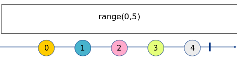

Exercise 1 
==========

_Marbles generated with: [RxMarbles Online](https://rx-marbles-online.herokuapp.com/)_

## [Goal](./index.test.js)

The goal of this exercise is to understand what an observable is and how to create a simple one. We will be using
the [range](https://rxjs.dev/api/index/function/range) observable builder.

range is a function that takes two numbers:

* first parameter, being the initial number of the range (inclusive)
* second parameter, being the quantity of numbers of the range

So, for example, for a range from 0 to 4, we would do:

```js
range(0, 5)
```


## [Solution](./index.js)

This exercise requires to use the `range` observable builder.