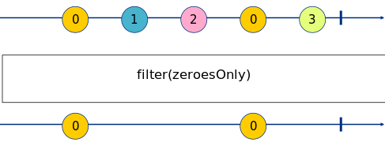

Exercise 2 
==========

_Marbles generated with: [RxMarbles Online](https://rx-marbles-online.herokuapp.com/)_

## [Goal](./index.test.js)

The goal of this exercise is to understand how to manipulate events received through an observable. The
[filter](https://rxjs.dev/api/operators/filter) operator allows to remove from the stream any event
not matching a predicate.

filter is a function that takes a parameter, which is the function predicate that will be applied to events.

So for example, if we want to filter out everything that is not a 0, you would do:

```js
filter(num => num === 0)
```


## [Solution](./index.js)

This exercise requires to use the `filter` operator and the `range` observer builder.