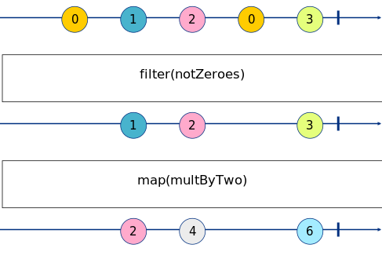

Exercise 3
==========

_Marbles generated with: [RxMarbles Online](https://rx-marbles-online.herokuapp.com/)_

## [Goal](./index.test.js)

The goal of this exercise is to understand how to manipulate events received through an observable. The
[filter](https://rxjs.dev/api/operators/filter) operator allows to remove from the stream any event
not matching a predicate. The [map](https://rxjs.dev/api/operators/map) operator allows to transform an event
in an observable by passing a mapping function.

So for example, if we want to filter out 0s, and multiply the resulting number by 2, we would do:

```js
filter(num => num !== 0)
map(num => num * 2)
```


## [Solution](./index.js)

This exercise requires to use the `filter` operator, the `map` operator and the `of` observer builder.