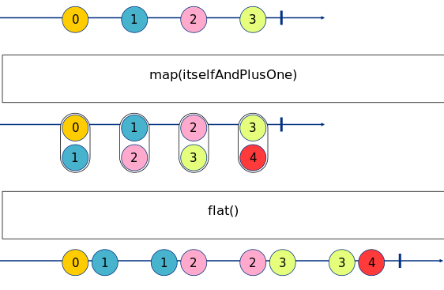

Exercise 4
==========

_Marbles generated with: [RxMarbles Online](https://rx-marbles-online.herokuapp.com/)_

## [Goal](./index.test.js)

The goal of this exercise is to understand how manipulate a set of observables to merge them. The
[flatMap](https://rxjs.dev/api/operators/flatMap) operator allows to merge observables that are generated
through events from the origin observable. 

It can be understood as two operators in one:

* An operator that takes an event, and generates an observable of events
* An operator that takes the observable of events, and merges it with the current stream

For example:

```js
flatMap(num => of(num, num + 1))
```


## [Solution](./index.js)

This exercise requires to use the `filter`, `flatMap`, `distinct` and `map` operators.