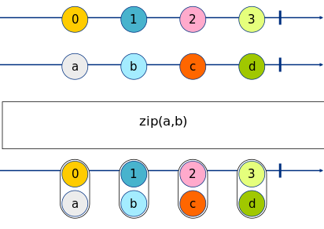

Exercise 5
==========

_Marbles generated with: [RxMarbles Online](https://rx-marbles-online.herokuapp.com/)_

## [Goal](./index.test.js)

The goal of this exercise is to understand how manipulate a set of observables to zip them. The
[zip](https://rxjs.dev/api/index/function/zip) observable builder allows to merge observables that are generated
through events from the origin observable. 

Zip takes one or more observables, and for each event
sent to these observables, generates a tuple of them
and pushes the tuple further in the stream.

For example:

```js
zip(a,b)
```


## [Solution](./index.js)

This exercise requires to use the `map` operator and the `zip` observer builder.